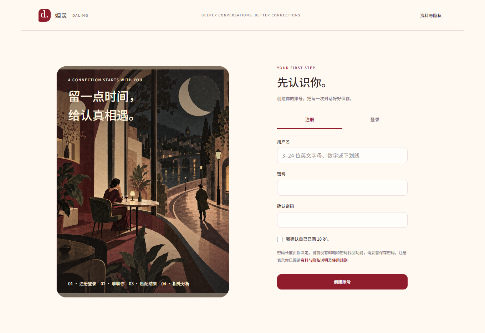
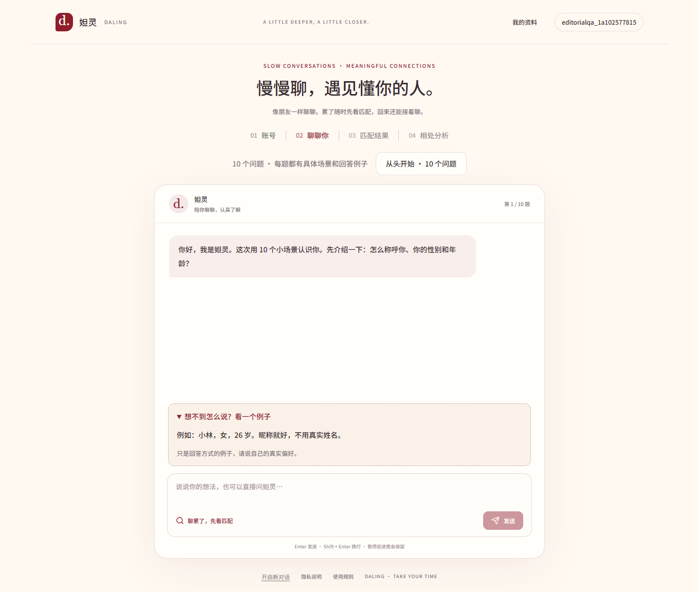
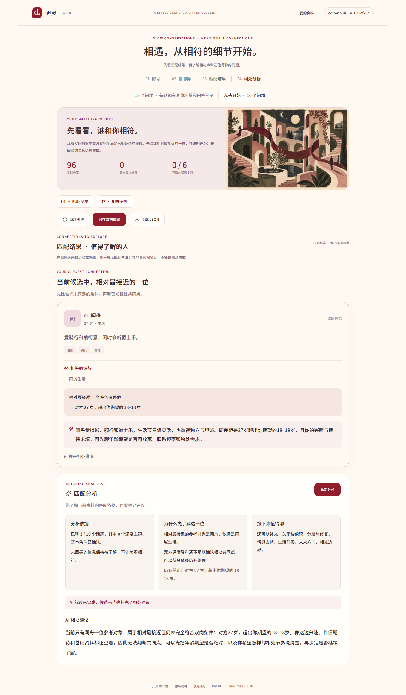
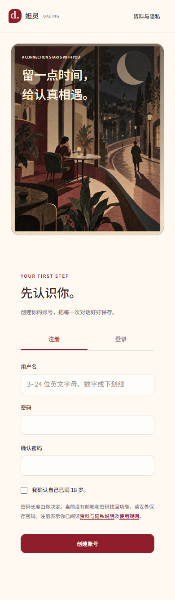
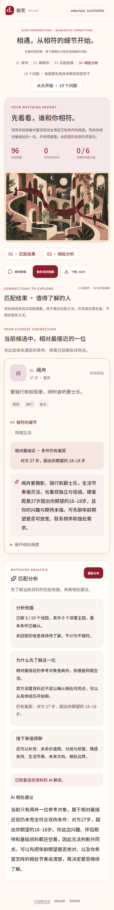
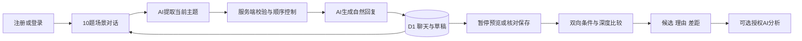

# 妲灵 · Daling AI Matching

用有顺序的自然对话，了解生活习惯与相处期待，生成可解释的双向匹配报告。

**[打开网页版](https://daling-ai-matching-smile.harebod.chatgpt.site/)** · [技术分析](TECHNICAL_ANALYSIS.md) · [商业化与留存诊断](docs/PRODUCT_AND_RETENTION.md)

<p align="center"></p>

> 当前是可使用的公开测试版。报告中的 96 份实验档案用于演示，不对应真实报名者；真实报名者在独立匹配池中展示。项目不宣称评分能够预测现实关系成功率。

## 你可以做什么

- **独立账号**：用户名与密码注册、登录，用户不需要 ChatGPT 账号。非空密码可用，最多 128 字符且 UTF-8 不超过 256 字节；注册需确认已满 18 岁。
- **10 题场景访谈**：每次用户回答都在服务端调用 AI，既回应用户，也按预定顺序继续。可展开回答例子，可跳过可选题。
- **随时停止**：点击「聊累了，先看匹配」得到当前资料的预览，之后可以继续。前三题必要资料齐全后，可核对授权并提前保存。
- **进度持久化**：账号内保存聊天、草稿和进度，刷新继续；「从头开始 · 10 个问题」开启新访谈。旧版 19 题对话仍可续聊。
- **完整 JSON 档案**：基础信息、明确偏好和六个深度主题保存成结构化档案；支持本人导出。
- **匹配理由与差距**：先双向筛选基本条件，再比较已知相处维度。实验池没有完全符合的候选时，仍给一位相对最接近的参考，并列出条件差距和未知项。
- **AI 相处分析**：报告先展示确定性的依据；再次授权后生成 AI 解读与候选建议。失败保留原报告，成功内容可恢复。
- **真实匹配互动**：自愿加入真实池后，可以心动、撤回和屏蔽；双方心动且都授权分享时才显示联系方式。

## 使用顺序

**注册登录 → 聊聊你 → 匹配结果 → 相处分析**

1. 打开网页版，创建站内账号。
2. 开始访谈；想休息时提前看匹配，想重新回答时从头开始。
3. 核对自己的档案；保存用途、加入真实池、分享联系方式分别授权。
4. 阅读首位候选的理由、差距和待确认问题；需要时点击「开始 AI 分析」。
5. 到「我的资料与真实匹配」管理真实互动与公开范围。

## 页面截图

截图来自实际运行页面中的独立测试账号，不包含真实用户档案或联系方式。报告截图刻意设置较窄年龄范围，展示没有完全符合候选时的真实页面行为；画面中的候选来自实验档案。

### 对话在中间，每题都有具体例子



### 首位参考对象、实际条件差距与 AI 分析



<details>
<summary>查看手机端：完整插画与匹配报告</summary>
<p> </p>
</details>

## 新访谈的 10 个主题

| 顺序 | 主题 | 场景或信息 |
| --- | --- | --- |
| 1 | 认识你 | 昵称、性别、年龄 |
| 2 | 城市与距离 | 住在哪座城市？只能周末见面的异地能否接受？ |
| 3 | 认识对象 | 朋友介绍一个人时，希望的性别和年龄范围 |
| 4 | 闲暇习惯 | 周六下午突然空下来，手机只剩 8% 电，最想做什么？ |
| 5 | 关系价值观 | 旧书店里发现一封陌生人的信，两个人想法不同，怎样被对待才舒服？ |
| 6 | 分歧与修复 | 期待的周末计划临时取消，接下来半小时怎么处理？ |
| 7 | 情感支持 | 深夜最后一班地铁停运，疲惫时希望对方怎么支持？ |
| 8 | 生活节奏 | 两天周末都空着，对方想一起待着，你也想做自己的事 |
| 9 | 未来方向 | 对方可能搬去另一座城市，哪些坚持、哪些能商量？ |
| 10 | 相处边界 | 刚交往，对方想看手机、一起买昂贵物品，怎样表达界限？ |

这是 10 个有序主题；资料不足或用户反问时，AI 可以在当前主题澄清，不会强行跳题。题目和示例仅作引导，不作为用户已表达的事实。

## 技术架构



| 部分 | 实现 |
| --- | --- |
| 前端 | React 19、Next.js 兼容的 Vinext、TypeScript、Tailwind、Motion |
| 后端 | Cloudflare Workers API 路由 |
| 数据库 | Cloudflare D1；Drizzle schema 与 6 份 SQL 迁移 |
| AI | 服务端 DeepSeek Chat Completions；当前代码使用 `deepseek-flash` |
| 账号 | 随机盐与分段 PBKDF2-SHA256；HttpOnly 会话；数据库保存令牌摘要 |
| 对话 | 每轮独立的信息提取调用与自然回复调用，服务端决定推进 |
| 匹配 | 双向基本条件过滤、六维深度比较、资料覆盖度、可解释差距 |
| 设计 | 奶油、酒红与植物色；完整场景插画；响应式布局与减少动画支持 |

**匹配边界：**“相对最接近”的放宽仅用于实验档案展示。真实池仍检查参与授权、公开状态、屏蔽及双向条件。AI 不决定资格、排序或联系方式权限。六维分数是产品比较规则，不是心理测评结论。

## 本地运行

要求 **Node.js 22.13+** 和 npm。Windows、macOS、Linux 的新克隆默认采用可移植运行方式，无需 Codex。

```sh
git clone https://github.com/DJDeborah/daling-ai-matching.git
cd daling-ai-matching
npm ci
npm run build
npm run db:migrate
```

把 [`.env.example`](.env.example) 复制为项目根目录的 `.env.local`，填写自己的 **服务端** DeepSeek key：

```dotenv
DEEPSEEK_API_KEY=replace_with_your_deepseek_key
```

```sh
npm run dev
```

访问 **http://127.0.0.1:5173**。本地数据库位于 `.wrangler/state`；`db:migrate` 只操作本地 D1，并通过迁移记录避免重复应用。它要求先构建生成 Worker 配置。

`db:migrate` 面向新库或已有迁移登记的库。旧版逐条手工执行 SQL 建立的本地库需先整理迁移登记，不能直接重复应用建表迁移。

未设置 key 时仍可注册、浏览界面和阅读已有档案的规则报告；AI 访谈会明确失败并保留输入与进度，不伪造回复。

### 本地运行构建产物

```sh
npm run build
npm run start -- --env-file ../../.env.local
```

这里的环境文件路径由 `dist/server/wrangler.json` 所在目录解析，指向根目录 `.env.local`；访问地址以 Wrangler 输出为准。

### 生产部署

现有网页版由 **Sites + Cloudflare Worker/D1** 托管。GitHub 保存可运行源码、迁移、截图与设计资源；用户数据和生产数据库不在仓库中。

自行部署时，需要配置实际 Worker、D1 数据库、全部迁移与服务端 `DEEPSEEK_API_KEY` secret。本仓库的 `.openai/hosting.json` 对应现有 Site，生成的本地 D1 ID 是占位符。GitHub Pages 的静态托管无法直接运行本项目的登录、数据库及 AI API。

## 主要目录

```text
app/                 页面与 API 路由
components/          交互与 UI 组件
lib/                 账号、访谈、资料、比较与报告逻辑
db/                  Drizzle 数据模型
drizzle/             全部 SQL 迁移与元数据
public/illustrations 场景插画与生成提示词
scripts/             本地启动、构建、数据库迁移
build/               Worker 与 Sites 的构建适配
docs/                截图、商业化与留存分析
```

重点源码：[访谈定义](lib/interview.ts) · [对话状态](lib/conversation.ts) · [实验档案](lib/demo-profiles.ts) · [双向筛选](lib/matching.ts) · [六维比较](lib/compatibility.ts) · [报告](lib/report.ts) · [AI 解读](lib/report-ai.ts)。

## 校验与已验证行为

```sh
npx tsc --noEmit --incremental false
npm run build
```

当前版本已执行真实线上 AI 对话和按钮验证：10 个主题顺序、每轮 AI 回执、暂停恢复、完整 JSON、提前保存、报告缓存、零严格候选时给相对参考、桌面和手机布局。开发期间的临时验证账号与运行工具不提交；这些记录不等于持续集成或商业留存数据。

## 当前限制与产品方向

目前没有照片／身份核验、密码找回、站内私信、完整举报处理、会面反馈、推荐通知或收费闭环。原始对话及深度 JSON 仅供本人读取；联系方式不发送给模型。

“完成问卷、阅读实验报告”已可以使用；商业化还需要验证真实供给、双方回应与后续相处价值。具体诊断、需要记录的漏斗和 14 天试验方案见 [商业化与留存诊断](docs/PRODUCT_AND_RETENTION.md)。

## 设计素材与第三方归属

当前两幅艺术场景插画通过内置图像生成制作，作品与 [提示词](public/illustrations/korean-editorial-prompts.txt) 均在仓库中。早期插画保留用于项目历史。

依赖与构建模板保留各自许可：[Sites 构建适配的 MIT 许可](build/sites-vite-plugin.LICENSE)、[Shadcn 样式许可](vendor/shadcn-tailwind-4.13.0.LICENSE.md)。其他第三方包许可以对应上游为准。项目未复制参考网站的源码或未授权素材。
