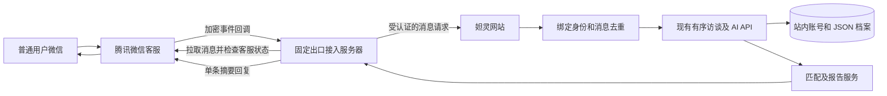

# 妲灵接入微信客服

接入层代码已实现；当前公开网站的微信入口尚未开通。需要先在企业微信后台配置应用，再部署接入服务器，最后做真实收发测试。

## 1. 从哪里登录

- [企业微信管理员后台登录](https://work.weixin.qq.com/wework_admin/loginpage_wx?from=myhome)：用管理员的微信扫码。
- [企业微信注册](https://work.weixin.qq.com/wework_admin/register_wx?from=myhome)：没有企业账号时先注册，按后台提示完成主体及管理员设置。

普通用户之后通过微信客服链接或二维码进入，不需要成为企业员工，也不需要 ChatGPT 账号。

## 2. 后台需要配置什么

1. 开通「微信客服」，创建妲灵客服账号，取得客服账号 ID `open_kfid`。
2. 在「应用管理」创建并启用自建应用，取得该应用的 Secret。
3. 在「微信客服 → 可调用接口的应用」授权这个应用，并把妲灵客服账号设为通过 API 管理。新接入按授权自建应用配置；不要直接套用旧教程的微信客服系统应用 Secret。
4. 从企业信息页面取得企业 ID `CorpID`。
5. 给应用配置接入服务器的可信出口 IP。需要自己控制的固定出口服务器；当前网页的共享 Worker 出口不能保证通过腾讯的可信 IP 校验。
6. 配置接收事件的 HTTPS 回调：`https://你的客服服务器域名/wechat/callback`，以及 Token 和 EncodingAESKey。域名需满足后台实际校验要求。
7. 部署接入服务器后，在后台保存回调配置；验证请求成功后再做实际消息测试。
8. 获取客服链接或二维码，作为用户入口。

CorpID、open_kfid 是标识。应用 Secret、Token、EncodingAESKey、桥接密钥通过服务器环境配置，不能放进公开仓库或网页代码。

## 3. 接入结构



腾讯应用 Secret 仅在接入服务器保存。网站接收可信服务器转发的消息，不接受客户端提交站内 userId；站内账号从绑定关系读取。微信身份不进入 AI 提示词。

## 4. 部署与环境配置

服务器代码、Docker、HTTPS 和运行命令见 [integrations/wechat/README.md](../integrations/wechat/README.md)。该服务是独立 Node 服务，不会随网页 Worker 部署自动启动。

网站服务端配置：

| 配置 | 用途 |
| --- | --- |
| `WECHAT_ENABLED=true` | 开启已配置的微信桥接及账号页入口 |
| `WECHAT_CORP_ID` | 与接入服务器相同的企业 ID |
| `WECHAT_OPEN_KFID` | 与接入服务器相同的客服账号 ID |
| `DALING_WECHAT_BRIDGE_SECRET` | 两端相同、至少 43 字符的随机密钥；推荐 32 字节随机数转 base64url |

AI 沿用现有服务器 DeepSeek 配置。无需再向微信服务器配置 AI key。上述网站配置用托管平台的服务器环境变量及密钥管理设置，保持 `WECHAT_ENABLED=false` 直到实际接入条件齐全。

## 5. 用户使用顺序

1. 打开 [妲灵网站](https://daling-ai-matching-smile.harebod.chatgpt.site/)，注册或登录用户名与密码账号，注册需确认满 18 岁。
2. 进入 `/account` 账号设置，在「微信里接着聊」生成绑定码。入口只在后台配置完整并开启后显示。
3. 打开妲灵微信客服，发送 `绑定 DL-XXXXXXXXXXXXXXXX`。绑定码有效期 10 分钟、只能使用一次；生成新码会使旧码失效。
4. 发 `开始` 或 `进度` 查看当前题目。正常回答进入现有 AI 访谈服务，AI 结合上下文回应，服务器维持题目顺序。
5. 随时发送 `暂停` 或 `匹配`，按已提供的资料给出首位候选的理由、差距及完整报告链接。
6. 发 `分析` 阅读处理说明，再发 `确认分析` 请求 AI 分析；不自动授权加入真实匹配池。

| 指令 | 行为 |
| --- | --- |
| 帮助 | 查看指令说明 |
| 开始 / 进度 | 查看当前题目和进度 |
| 暂停 / 停止 / 匹配 | 提前匹配，保留未知信息 |
| 继续 / 补充资料 | 接着聊；已保存档案可补充深度话题 |
| 分析 / 确认分析 | 说明用途后请求 AI 匹配解读 |
| 重新开始 / 确认重新开始 | 确认后重置当前对话，保留已保存档案 |
| 保存 / 加入匹配池 / 解绑 | 引导到网站核对或账号管理 |

实验候选在微信摘要中明确标注来源，不可联系。真实候选仍需站内授权及双向条件筛选，去网站查看。完整报告链接需要登录本人账号，不携带登录令牌。

## 6. 重投、并发和资料控制

- 加密回调先写入 SQLite 再返回空 200，AI 不在回调时限内执行。
- 接入服务器持久化拉取 cursor、收件箱及回复状态；网站以身份和消息 ID 的摘要去重，锁定账号的微信处理。
- 重复消息不重复推进题目或调用 AI。无法确定是否完成的中断只提示用户发送「进度」核对；不自动重新提交同一回答。
- 网站和微信最终更新均使用原有题号与 revision 校验。两处同时回答时，冲突方提示查看当前题目。
- 解绑及删除账号清除关联和个人回复，短期保留不含正文、不关联账号的去重摘要，防止旧消息进入换绑后的新账号。删除交友资料会取消尚未完成的旧报告回复。
- 服务器重新发送前检查客服状态。人工接待、排队或已结束的会话跳过；腾讯发送结果不确定时不盲目重发。
- 微信回复使用单条 2048 UTF-8 字节以内的摘要。遵守腾讯的主动消息窗口和回复次数限制。
- 网站在消息处理时清理超过 7 天的去重记录；接入服务器运行时清理超过 72 小时的正文和回复。

已经生成并交给接入服务器、微信或 AI 服务的内容无法通过站内解绑撤回。接入服务器和微信里的历史记录需要在各自系统管理。

## 7. 验证

```sh
node --test tests/wechat-bridge.test.mjs
node --test integrations/wechat/*.test.mjs
npx tsc --noEmit --incremental false
npm run build
```

测试使用模拟腾讯和 AI 边界及独立 SQLite；不消耗真实用户 AI 次数。它们覆盖验签解密、回调可靠落盘、cursor、人工接管、发送未知结果、身份与绑定、重投、并发及删除竞态。

真实验证仍需在企业微信完成：回调保存成功 → 新微信账号打开客服 → 绑定站内账号 → 回答一题 → 检查网站同题进度 → 暂停匹配 → 确认分析 → 测试解绑与人工接管。

## 8. 旧项目能确认什么

提供的旧 `testDaling2.py` 是终端程序：判断回答是否符合当前题、根据历史追问、生成自然回应并推进题号。没有找到微信 SDK、消息回调或接入服务器代码，因此无法确定以前使用的微信平台。

本次复用当前网页里的同类问答核心，并补充微信客服收发、账号绑定和多人进度隔离。

## 腾讯官方资料

- [微信客服概述](https://developer.work.weixin.qq.com/document/path/94638)
- [获取客服链接](https://developer.work.weixin.qq.com/document/path/94665)
- [接收消息及事件](https://developer.work.weixin.qq.com/document/path/94670)
- [发送消息及新接入应用授权要求](https://developer.work.weixin.qq.com/document/path/94677)
- [回调配置](https://developer.work.weixin.qq.com/document/path/90930)
- [消息加解密](https://developer.work.weixin.qq.com/document/path/90968)
- [获取 access_token](https://developer.work.weixin.qq.com/document/path/91039)
- [可信 IP 要求](https://developer.work.weixin.qq.com/community/announcement/detail?content_id=16334603338859177543)

核对日期：2026-10-04。
